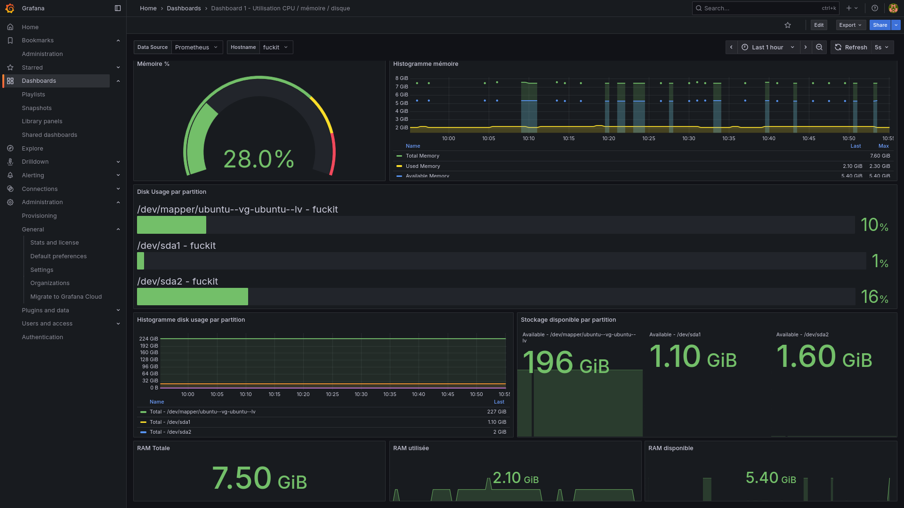
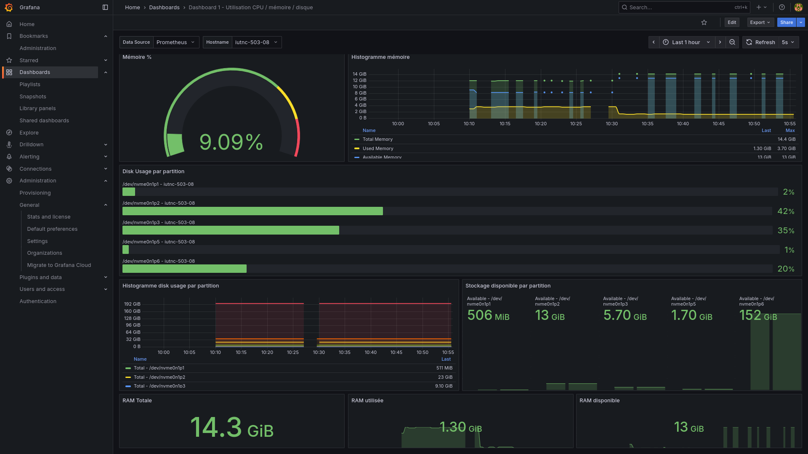
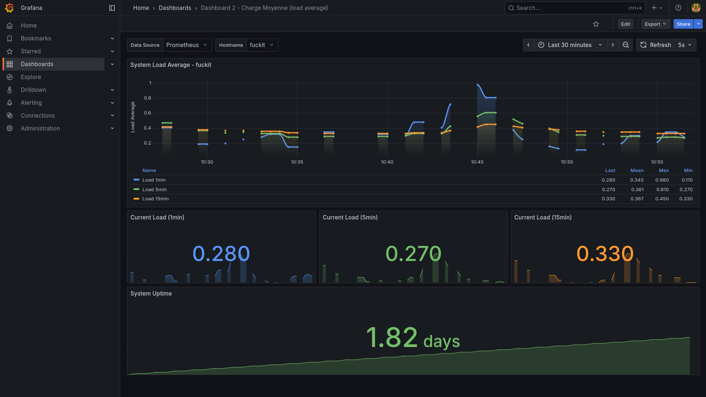
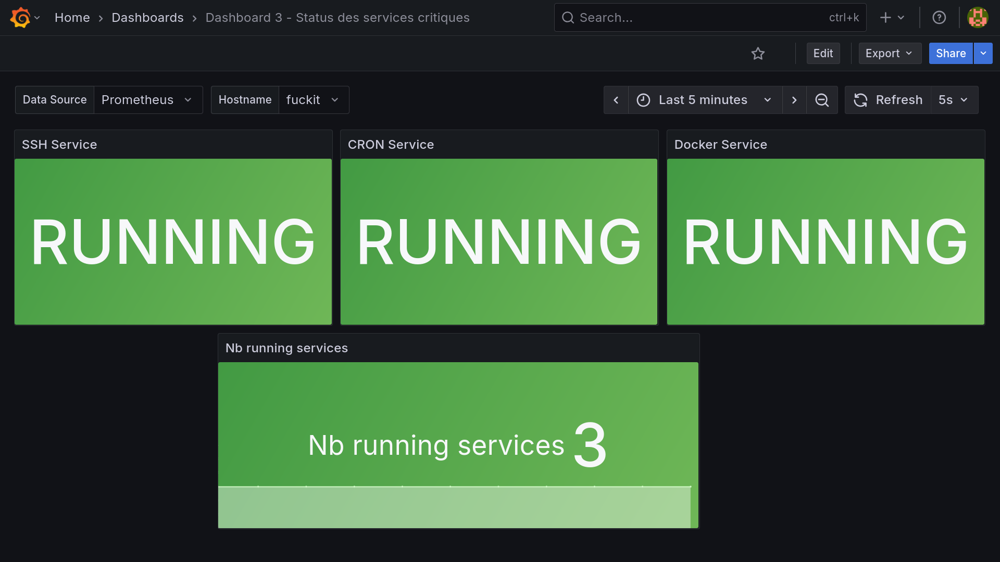

# Projet d’Audit et de Déploiement

Ce projet a pour objectif de **déployer une infrastructure d’audit et de monitoring** automatisée à l’aide de **Prometheus**, **Grafana** et d’un **agent d’audit** développé sur mesure.  
Il permet d’assurer une supervision continue des systèmes et d’automatiser la collecte d’informations de performance et de sécurité.

---

## Structure du projet

```

Projet-audit-et-d-ploiement/
├── monitoring-infrastructure/
│   ├── prometheus/
│   │   ├── docker-compose.yml          # Stack Prometheus + Grafana
│   │   ├── prometheus.yml              # Configuration des jobs Prometheus
│   │   └── grafana/
│   │       └── provisioning/
│   │           └── datasources/
│   │               └── prometheus.yml  # Datasource Grafana pour Prometheus
│   └── agent/
│       ├── Dockerfile                  # Image de l’agent d’audit
│       ├── docker-compose.yml          # Déploiement de l’agent
│       ├── deploy.sh                   # Script de déploiement automatisé
│       ├── audit.rb                    # Script principal d’audit (Ruby)
│       └── cron/
│           └── audit_cron              # Tâche planifiée pour exécuter l’audit
└── .gitignore

````

---

## Lancer le projet

### 1. Prérequis
Assure-toi d’avoir installé :
- **Docker** et **Docker Compose**
- **Git** (pour le clonage)
- (Optionnel) **Ruby** si tu veux exécuter le script `audit.rb` hors container

### 2. Cloner le dépôt
```bash
git clone https://github.com/votre-utilisateur/Projet-audit-et-deploiement.git
cd Projet-audit-et-deploiement
````

### 3. Démarrer Prometheus & Grafana

```bash
cd monitoring-infrastructure/prometheus
docker-compose up -d
```

* Prometheus sera accessible sur : **[http://localhost:9090](http://localhost:9090)**
* Grafana sera accessible sur : **[http://localhost:3000](http://localhost:3000)**

### 4. Déployer l’agent d’audit

```bash
cd ../agent
bash deploy.sh
```

L’agent collectera automatiquement les métriques selon la configuration du cron (`audit_cron`).

---

## Fonctionnalités

*  **Surveillance système en temps réel** (CPU, mémoire, disques, etc.)
*  **Audit automatisé** via scripts Ruby planifiés
*  **Infrastructure modulaire** avec Docker Compose
*  **Déploiement simplifié** grâce à `deploy.sh`
*  **Visualisation** des données via Grafana

---

##  Technologies utilisées

| Composant            | Description                           |
| -------------------- | ------------------------------------- |
| **Docker / Compose** | Conteneurisation et orchestration     |
| **Prometheus**       | Collecte et stockage des métriques    |
| **Grafana**          | Visualisation des métriques           |
| **Ruby**             | Langage de script pour l’audit        |
| **Cron**             | Automatisation des tâches périodiques |


##  Explications techniques des choix réalisés

L’architecture du projet repose sur deux composants principaux :  
1. **Une partie serveur**, dédiée à la collecte et à la visualisation des métriques.  
2. **Une partie agent**, déployée sur les machines à superviser.  

###  Partie serveur (Prometheus & Grafana via Docker)
La partie serveur est intégralement **conteneurisée avec Docker** pour simplifier le déploiement, la portabilité et la maintenance.  
Elle comprend :
- **Prometheus**, chargé de collecter les métriques des différentes machines observées.  
- **Grafana**, utilisé pour la visualisation graphique et la création de tableaux de bord dynamiques.  

Le fichier `docker-compose.yml` permet de lancer l’ensemble de la stack d’un simple `docker-compose up -d`.  
Pour ajouter une nouvelle machine à surveiller, il suffit **d’ajouter son adresse IP** dans le fichier `prometheus.yml` sous la section des cibles (`targets:`).  

Cette approche offre :
- Une **infrastructure centralisée** de supervision.  
- Une **configuration simple et modulaire**.  

---

###  Partie agent (Audit Ruby + Node Exporter)
Chaque machine à monitorer doit exécuter un **agent local** constitué de :
- Un **script Ruby (`audit.rb`)**, qui collecte des informations spécifiques à la machine (système, processus, performances, etc.).  
- Un **Node Exporter**, outil standard de Prometheus, qui expose les métriques système (CPU, mémoire, disque, etc.) sur un port HTTP.  

L’agent est déployé via un **conteneur Docker** grâce à un **script `deploy.sh`**.  
Ce choix permet :
- Un déploiement rapide et reproductible sur toute machine compatible Docker.  
- Une isolation des dépendances et des configurations locales.  
- Une facilité de mise à jour ou de suppression de l’agent.

---

##  Maintenance et évolution

* Ajouter de nouvelles métriques à surveiller via `prometheus.yml`
* Étendre l’agent Ruby pour collecter des indicateurs spécifiques
* Intégrer des alertes Prometheus / Grafana selon les seuils définis

---

##  Critique et axes d’amélioration

Le déploiement actuel repose sur une **procédure manuelle** :  
chaque machine doit **cloner le dépôt** puis exécuter le script `deploy.sh` pour lancer l’agent.  
Bien que cela fonctionne pour un petit nombre de serveurs, cette méthode n’est **pas adaptée à une mise à l’échelle**.  

Une amélioration possible serait d’utiliser un outil de gestion de configuration comme **Ansible**, **Puppet** ou **Terraform**, afin de :
- Automatiser le déploiement de l’agent sur plusieurs machines en parallèle.  
- Centraliser la configuration réseau et les variables d’environnement.  
- Réduire le risque d’erreurs humaines lors de l’installation.

Concernant le **script `audit.rb`**, il constitue un **excellent exercice pédagogique** pour comprendre le fonctionnement interne d’un agent de monitoring.  
Cependant, dans une approche de production :
- Des solutions existantes comme **Node Exporter**, **Telegraf** ou **CollectD** sont **plus complètes**, **plus performantes**, et déjà **intégrées à l’écosystème Prometheus**.  
- Ces outils fournissent une **grande variété de métriques** sans nécessiter de développement supplémentaire.  

En résumé, le projet présente une **architecture claire, fonctionnelle et instructive**, mais qui pourrait être **optimisée et automatisée** pour un usage en environnement de production à grande échelle.

---

## Capture d'écran des tableaux de bord de Grafana






---
##  Auteurs

* **Gabriel Comte**
* **Oscar Tom Denis**
* **Adrien Mangin**

